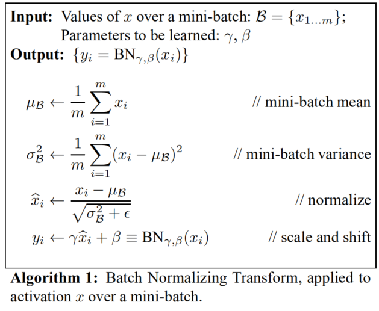

<b>Batch Normalization</b>

##### BN 提出的动机
Batch Normalization 的提出是为了解决内部方差偏移（internal covariate shift,ICS）的问题。 论文：[Batch Normalization: Accelerating Deep Network Training by Reducing Internal Covariate Shift](resource/BatchNormalization/BatchNormalization.pdf)
ICS是指神经网络种前面层的参数变化导致后面层的输入发生变化。
ICS使得模型训练需要使用较小的学习率和精细的参数初始化，从而减慢模型训练速度。并且使得训练具有饱和非线性得模型变得非常困难。

##### BN 的效果
* 加速模型的训练（缓解梯度消失，支持更大的学习率）
* 降低参数初始化的要求
* 减少过拟合
  
##### 原理
* BN会针对**每一批训练数据**，在网络的**每一层输入**之前做**归一化**处理，使输入的均值为0，标准差为1。目的是将**数据**限制在统一的**分布**下。
* 具体来说，针对每层的第 k 个神经元，计算这一批数据在第 k 个神经元的均值与标准差，然后将**归一化**后的值作为该神经元的激活值。
  
* BN 可以看作在各层之间加入了一个新的计算层，**对数据分布进行额外的约束**。
* **梯度优化算法需要参与到BN中，否则BN和梯度优化的作用会相互抵消**，导致loss不变，权重一直更新变成无穷大。[作者在论文第2节花了比较大的篇幅讨论这个问题] 直接将BN加入到优化算法会增加很多计算量，因为要计算层输入的协方差矩阵及其平方根。所以作者引入了一对可训练参数$\gamma^{(k)}$，$\beta^{(k)}$，用来缩放平移归一化后的值：$y^{(k)}=\gamma^{(k)} \widehat{x}^{(k)}+\beta^{(k)}$。这组参数也使得模型具有恢复原输入的能力。（有很多文章讲到这两个参数时都说是“为了恢复原输入”，这显然是不对的。）
  
##### 训练时的计算过程：

反向传播参数更新：

##### 推理时的计算过程：
训练时BN的计算不仅依赖当前输入$x_i$还依赖当前mini-batch，测试推理时为了保证只依赖当前输入采用下面的方式计算BN：

其中， $\mathrm{E}[x]$ 和 $\operatorname{Var}[x]$ 在训练过程中由mini-batch的均值和方差通过移动平均计算得到，训练完成后保存在模型中。Using moving averages instead, we can track the accuracy of a model as it trains.

**参考**
[1] [Batch Normalization: Accelerating Deep Network Training by Reducing Internal Covariate Shift](resource/BatchNormalization/BatchNormalization.pdf)
[2] https://github.com/imhuay/Algorithm_Interview_Notes-Chinese/blob/master/A-%E6%B7%B1%E5%BA%A6%E5%AD%A6%E4%B9%A0/A-%E6%B7%B1%E5%BA%A6%E5%AD%A6%E4%B9%A0%E5%9F%BA%E7%A1%80.md#%E6%AD%A3%E5%88%99%E5%8C%96
[3] http://www.caffecn.cn/?/question/165