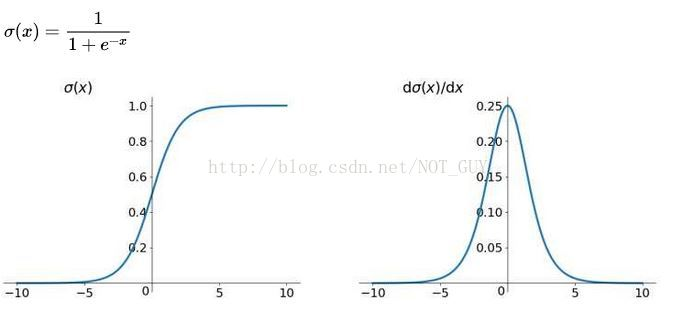
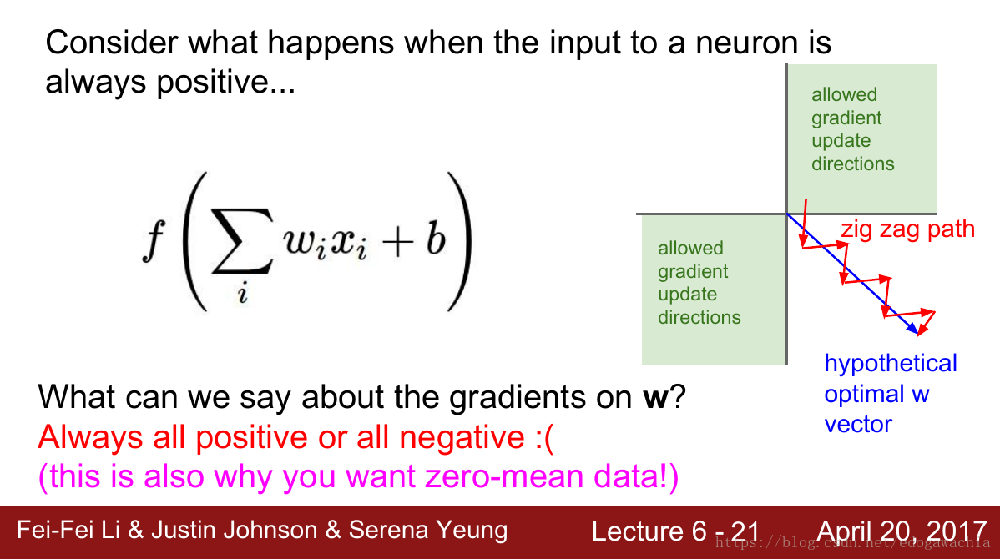
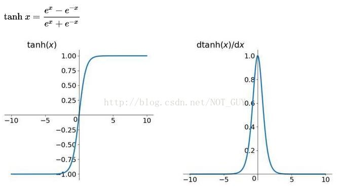
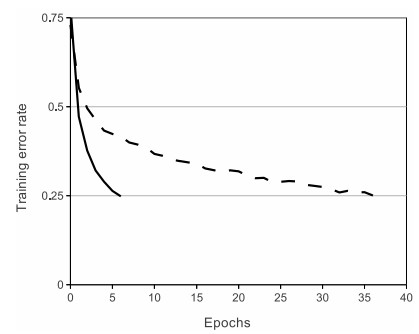
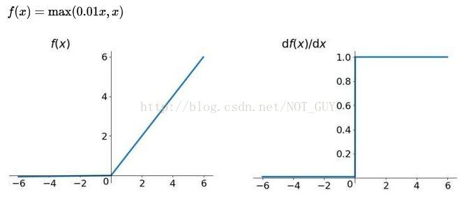

<center><b>神经网络常用激活函数及其变体</b></center>


* Sigmoid
  
  
  
  导数公式：
  $$ \sigma'(x) = \sigma(x)(1-\sigma(x))$$

  优点：
  （1）求导方便
  （2）能压缩数据幅值
  缺点：
  （1）容易导致网络出现梯度消失，因为这个激活函数容易进入饱和区。详见[梯度消失与梯度爆炸](神经网络.md#title-3)
  （2）幂运算耗时（前向传播时）
  （3）输出不是以0为中心。这会导致后面层的输入不是以0为中心。这对梯度下降是有影响的，因为如果一个神经元的输入总是正的（比如 $x>0, f= w^Tx+b$），然后权重$w$的梯度在反向传播期间都是正的，或者都是负的（取决于整个表达式$f$的梯度）。这会引入我们不期望的锯齿状权重梯度更新路径。不过，使用batch data训练时能够产生变化的符号，可以缓解这个问题。它比激活函数饱和的问题的影响要小。
  锯齿梯度更新原理：
  
  

* Tanh
  
  导数公式：$tanh'(x)=1-tanh^2(x)$
  tanh 和 sigmoid 的关系：$tanh(x) = 2sigmoid(2x)-1$
  
  只是对sigmoid进行了缩放平移，解决了sigmoid 输出中心不是0的问题，其它特性和sigmoid相同。
  优点：
  （1）求导方便
  （2）能够压缩数据幅值
  缺点：
  （1）容易导致网络出现梯度消失，因为这个激活函数容易进入饱和区。
  （2）幂运算耗时（前向传播时）

* ReLU
  
  
  A plot from Krizhevsky et al. (pdf) paper indicating the 6x improvement in convergence with the ReLU unit compared to the tanh unit.
  收敛更快，这里说的是收敛的训练次数更少。实际上时间也更少。
  优点：
  （1）收敛更快。与sigmoid/tanh相比，随机梯度下降的收敛非常快。人们认为是由于它的线性和非饱和形式决定的。
  （2）实现简单。与tanh/sigmoid引入复杂的操作相比（指数等），ReLU可以简单地通过jiang激活矩阵阈值设置为0来实现ReLU。
  缺点：
  （1）导致神经元“死亡”。比如，一个大梯度流经一个ReLU神经元可能会将梯度更新到这个神经元不会再被激活的状态。学习率太高容易出现这种情况。详见 [Dying ReLU](Dying_ReLU.md)

* Leaky ReLU
  
  
  公式：$f(x)=max(\alpha x, x)$, x<0时的系数可选，不一定是0.01。
  Leaky ReLU试图去解决 "dying ReLU"问题,效果并不一定好（the results are not always consistent）。

* ELU
  
  解决了"dying ReLU"问题。
  

* Maxout
  公式：$max(w_1^Tx=b_1, w_2^Tx+b_2)$
  它是ReLU和Leaky ReLU的一般版本。
  Maxout有ReLU所有的优点（线性，无饱和区）没有ReLU的缺点（dying ReLU）。但是参数量是ReLU的两倍。
  **注意:**这里只是举个例子，$w$的维度不一定是2。
  Keras实现：
  ```
  # input shape:  [n, input_dim]
  # output shape: [n, output_dim]
  W = init(shape=[k, input_dim, output_dim])
  b = zeros(shape=[k, output_dim])
  output = K.max(K.dot(x, W) + b, axis=1)
  ```
  
* 来自[cs231n](http://cs231n.github.io/neural-networks-1/)的建议:
  建议使用ReLU,注意学习率和可能出现的"dying ReLU"。如果不行，尝试 Leaky ReLU或Maxout。不要使用sigmoid和Tanh。


* **参考**
  http://cs231n.github.io/neural-networks-1/
  https://blog.csdn.net/NOT_GUY/article/details/78749509